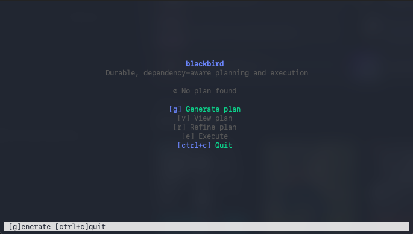

# Blackbird

The control plane for durable, dependency-aware planning and execution with AI agents.

## What it does

- Maintains a validated, dependency-aware work graph in a single JSON plan file.
- Surfaces readiness so you can see what is actionable next.
- Runs agent-backed plan generation/refinement and dependency inference.
- Executes ready tasks with a headless agent runtime, logging runs for traceability.
- Provides a TUI for interactive navigation, detail views, and execution status.

## Install

Requires Go 1.22+.

```bash
go build -o blackbird ./cmd/blackbird
# or: go install ./cmd/blackbird
```

## Quickstart

1. **Initialize** a plan file: `blackbird init`
2. **Generate** an initial plan: `blackbird plan generate`
3. **Launch the TUI** (default entrypoint): `blackbird`
4. **List** ready work: `blackbird list`
5. **Execute** ready tasks: `blackbird execute`
6. **Resume** a waiting task: `blackbird resume <taskID>`
7. **View run history**: `blackbird runs <taskID>`

The plan file lives at repo root as `blackbird.plan.json`.

## Memory (Codex only)

Blackbird can capture Codex traffic via a local proxy to build durable memory artifacts and context packs. Memory features are only active for the Codex provider; Claude ignores memory settings. Disable memory by setting `memory.mode` to `off` in config.

Common CLI usage:

- `blackbird mem search "decision"`
- `blackbird mem get <artifact_id>`
- `blackbird mem context --task <id>`

See [docs/CONFIGURATION.md](docs/CONFIGURATION.md) and [docs/COMMANDS.md](docs/COMMANDS.md) for full details.

## TUI

Running `blackbird` with no arguments opens the TUI: plan tree on the left, details/execution on the right, action shortcuts in the bottom bar.



See [docs/TUI.md](docs/TUI.md) for layout and key bindings.

## Documentation

| Topic                                        | Doc                                                                      |
| -------------------------------------------- | ------------------------------------------------------------------------ |
| **Commands** (plan, manual edits, execution) | [docs/COMMANDS.md](docs/COMMANDS.md)                                     |
| **TUI** (layout, key bindings)               | [docs/TUI.md](docs/TUI.md)                                               |
| **Readiness rules**                          | [docs/READINESS.md](docs/READINESS.md)                                   |
| **Agent configuration**                      | [docs/CONFIGURATION.md](docs/CONFIGURATION.md)                           |
| **Files and storage**                        | [docs/FILES_AND_STORAGE.md](docs/FILES_AND_STORAGE.md)                   |
| **Documentation index**                      | [docs/README.md](docs/README.md)                                         |
| **Project overview**                         | [OVERVIEW.md](OVERVIEW.md)                                               |
| **Execution architecture**                   | [internal/execution/README.md](internal/execution/README.md)             |
| **Agent question flow**                      | [docs/AGENT_QUESTIONS_FLOW.md](docs/AGENT_QUESTIONS_FLOW.md)             |
| **Plan review flow**                         | [docs/PLAN_REVIEW_FLOW.md](docs/PLAN_REVIEW_FLOW.md)                     |
| **Testing**                                  | [docs/testing/TESTING_QUICKSTART.md](docs/testing/TESTING_QUICKSTART.md) |
| **Specs and milestones**                     | [specs/](specs/)                                                         |
