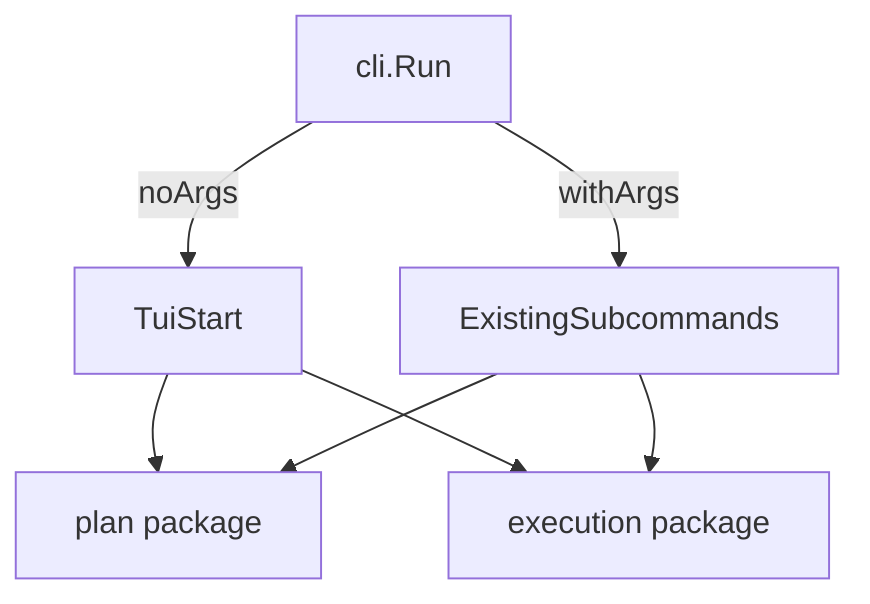

status: complete
---
name: tui-dashboard
overview: Add a Bubble Tea-based TUI that becomes the default when `blackbird` is run without args, while preserving existing subcommands and execution flows.
todos:
  - id: tui-scaffold
    content: Add Bubble Tea TUI skeleton + entrypoint hook
    status: pending
  - id: plan-navigation
    content: Implement plan tree + detail pane views
    status: pending
  - id: execution-dashboard
    content: Add run state + elapsed time dashboard
    status: pending
  - id: actions-integration
    content: Wire plan generate/revise + execute actions
    status: pending
  - id: tests-log
    content: Add minimal tests + update AGENT_LOG
    status: pending
---

# TUI Default Entry Plan

## Approach

- Use Bubble Tea (low-dependency, Go-native) for a multi-pane TUI: plan generate/revise, plan traversal, and execution dashboard with live run state + elapsed time.
- Preserve existing CLI commands by routing only the zero-args case to TUI; all subcommands remain untouched.
- Reuse existing planning/execution logic (`internal/cli` and `internal/execution`) instead of reimplementing behavior in the TUI.

## Key code touchpoints

- CLI entry: update [`internal/cli/cli.go`](/Users/jackbonatakis/repos/blackbird/internal/cli/cli.go) to treat no-args as “launch TUI” instead of a usage error.
- New TUI package: add [`internal/tui`](/Users/jackbonatakis/repos/blackbird/internal/tui) with Bubble Tea model, views, and message loop.
- Execution data: reuse [`internal/execution`](/Users/jackbonatakis/repos/blackbird/internal/execution) for run records, status updates, and ready-task selection.
- Plan data: reuse [`internal/plan`](/Users/jackbonatakis/repos/blackbird/internal/plan) for plan traversal and status updates.
- Update [`AGENT_LOG.md`](/Users/jackbonatakis/repos/blackbird/AGENT_LOG.md) with a short entry on TUI scope and decisions.

## UI Structure (initial)

- **Left pane**: plan tree (filterable by status), with current selection.
- **Right pane (tabs)**:
  - **Details**: item details + deps + readiness.
  - **Plan**: generate/revise shortcuts (reuse existing plan generate/refine flows).
  - **Execution**: active run state, elapsed time, latest run log excerpt, and remaining tasks summary.
- **Bottom bar**: contextual actions + status (ready/blocked counts, current task/run status).

## Execution Dashboard behavior

- Read latest run per task from `.blackbird/runs` to display:
  - Current task in `running`/`waiting_user`, elapsed time, exit status.
  - Remaining ready tasks count (via `execution.ReadyTasks`).
- Live elapsed time from `StartedAt` when `CompletedAt` is nil.
- “Start execution” action calls the existing execute flow (one-at-a-time loop) using shared logic, with output captured to run records.

## Integration steps

- Add a new TUI entrypoint (e.g., `tui.Start()` in `internal/tui`) invoked by `cli.Run` when `len(args)==0`.
- Keep subcommands intact by preserving `cli.Run` switch for non-empty args.
- Provide helper wrappers in `internal/tui` to call existing CLI flows (`runPlan`, `runExecute`, `runResume`, etc.) as needed, with UI-friendly error handling.
- Add minimal styling (colors, bold) using Bubble Tea’s styling utilities for status labels and headers.

## Tests

- Add unit tests for any new TUI-independent logic (e.g., formatting helpers, run state computations).
- Keep existing CLI tests intact; add a small CLI test that `Run([]string{})` launches TUI (mocked entrypoint).

## Mermaid overview

## Risks and mitigations

- **Blocking behavior in execute loop**: wrap execution calls in Bubble Tea commands so UI remains responsive.
- **Concurrent access to plan file**: reuse existing atomic writes and validate before write in execution flows.
- **Cross-platform terminal sizing**: use Bubble Tea window size messages and redraw layout on resize.

## Deliverables

- TUI package with core navigation and execution dashboard.
- CLI entry updated so `blackbird` opens TUI by default.
- AGENT_LOG updated with implementation notes and any decisions.
